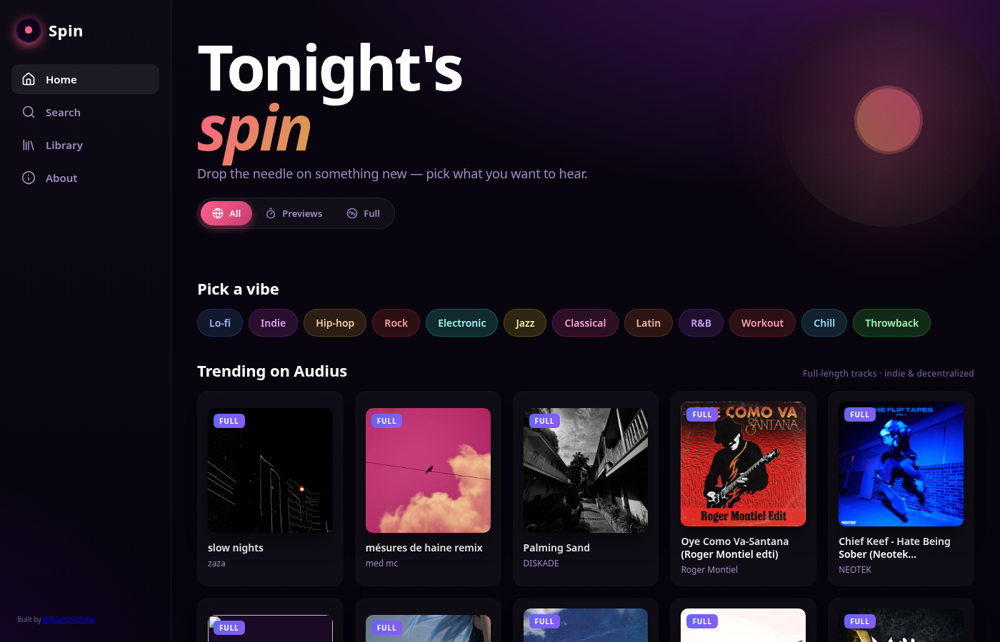
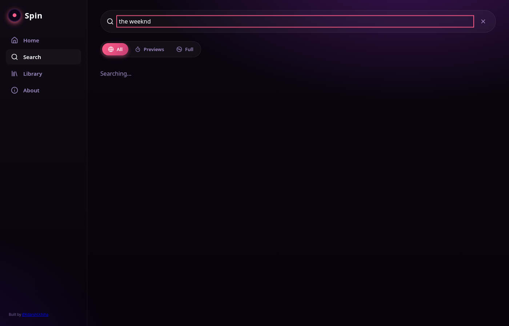
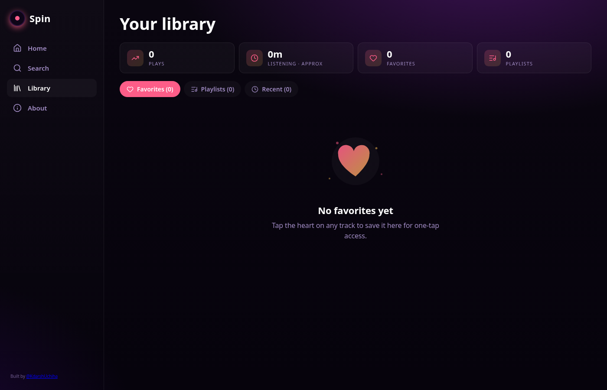
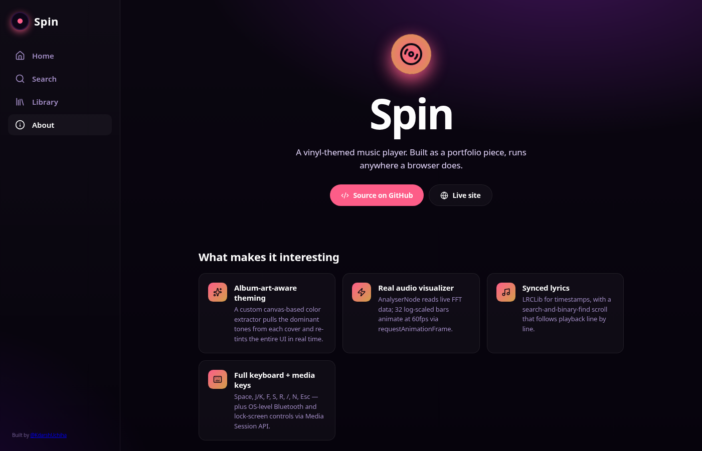
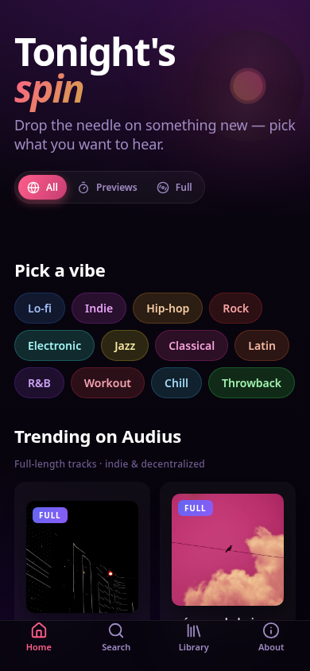
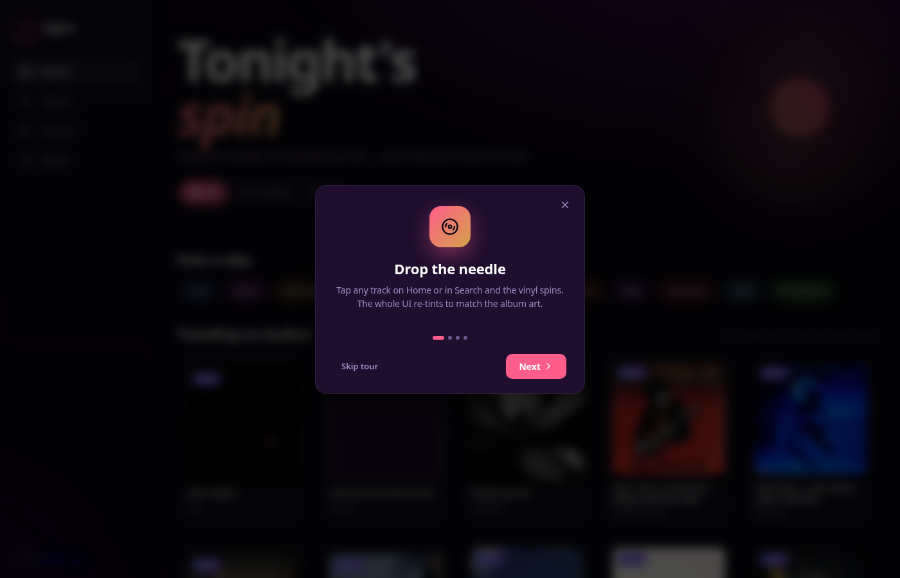

# Spin — Vinyl Music Player

> A PWA music player with album-art-aware theming, real-time audio visualizer, synced lyrics, drag-reorder queue, and full keyboard control. Built with React, deployed to GitHub Pages.

**🔗 [Live demo →](https://kdarshuchiha.github.io/spin-vinyl-player/)**



---

## Why I built this

I wanted a portfolio piece that goes beyond CRUD. A music player gives me an excuse to touch the Web Audio API, Media Session API, real-time animations, color extraction, third-party REST APIs, and PWA platform integration — all in one project. The vinyl theme keeps it visually unique instead of a Spotify clone.

## Highlights

- **🎨 Album-art-aware theming** — A canvas-based color extractor pulls the dominant tones from each track's artwork and re-tints the entire UI in real time (logo, gradients, vinyl label, visualizer, EQ chips, mini-player).
- **🎚️ Real audio visualizer** — `AnalyserNode` reads live FFT data from the audio element; 32 log-scaled bars animate at 60 fps via `requestAnimationFrame`.
- **🎤 Synced lyrics** — LRCLib integration with millisecond-accurate scrolling. Tap any line to seek there. Falls back to plain lyrics when no LRC is available.
- **⌨️ Full keyboard control** — Space, J/K, F, S, R, /, N, Esc — and OS-level Bluetooth + lock-screen controls via Media Session API.
- **🎛️ 5-band parametric EQ** — Web Audio `BiquadFilter` chain with Off / Bass Boost / Vocal / Treble / Lounge presets.
- **📱 PWA** — Installable on phones/tablets/TVs, works offline (cached shell), service worker handles updates.

## Screenshots

|  |  |
|---|---|
|  |  |
| **Home** — genre chips, source filter, art-aware theming | **Search** — blended iTunes + Audius results, infinite scroll |
|  |  |
| **Library** — listening stats, top track, favorites, playlists | **About** — tech stack, keyboard shortcuts, what's next |

| Mobile (375px) | Tablet (768px) | Onboarding |
|---|---|---|
|  | (responsive bottom nav) |  |

## Tech stack

| Layer | What |
|---|---|
| **UI** | React 19, Vite, Framer Motion, Lucide icons, plain CSS (custom properties + container queries) |
| **Audio** | Web Audio API (`AudioContext`, `AnalyserNode`, `BiquadFilterNode`), HTML5 `<audio>`, Media Session API |
| **Data** | iTunes Search API (no auth, 30s previews), Audius public API (full-length indie tracks), LRCLib (synced lyrics) |
| **Platform** | PWA service worker, Web Share API, IntersectionObserver, localStorage for state |
| **Deploy** | GitHub Pages via GitHub Actions, `base: './'` so it works at any sub-path |

## Architecture

```
src/
├── api/                 # REST clients for music + lyrics
│   ├── music.js         # iTunes & Audius, unified track shape
│   └── lyrics.js        # LRCLib + LRC parser
├── context/
│   └── PlayerContext    # Audio graph, queue, favorites, EQ, theming, sleep timer
├── hooks/
│   ├── useArtworkPalette.js   # Canvas color extraction
│   ├── useReveal.js           # IntersectionObserver scroll reveal
│   ├── useMediaSession.js     # Lock-screen integration
│   └── useHotkeys.js          # Global keyboard shortcuts
├── components/
│   ├── Vinyl.jsx, HeroVinyl.jsx, Visualizer.jsx
│   ├── MiniPlayer.jsx, QueuePanel.jsx, Lyrics.jsx
│   ├── SourceFilter.jsx, TrackRow.jsx, EmptyState.jsx
│   ├── Toast.jsx, OnboardingTour.jsx
└── screens/
    ├── Home.jsx, Search.jsx, Library.jsx
    ├── NowPlaying.jsx, About.jsx
```

The audio graph is built **once** when the user first plays a track:

```
<audio>  →  BiquadFilter ×5 (EQ chain)  →  AnalyserNode  →  destination
```

This single graph powers the visualizer, EQ, and playback. The `MediaElementSourceNode` is created lazily because Safari requires a user gesture before the AudioContext can be unsuspended.

## Notable problems I solved

- **CORS for the analyser** — `AnalyserNode` returns silence unless audio is same-origin or has CORS headers. I set `crossOrigin = 'anonymous'` and listen for `error`; on failure I retry without crossOrigin so playback still works (the visualizer falls back to a CSS animation).
- **Color extraction** — Naive averaging gives muddy gray. I bucket pixels by quantized HSL, weight by saturation, and pick the most saturated cluster. Then clamp lightness to [30, 75] so the theme stays legible on dark backgrounds.
- **Synced-lyric performance** — Scrolling 100+ lines and finding the active one every `timeupdate` (~4Hz) needs a binary search, plus a guard so `scrollIntoView` only fires when the active index actually changes.
- **GitHub Pages SPA fallback** — Pages 404s on deep links. The build script copies `index.html` to `404.html` so client-side routing keeps working.

## Run locally

```bash
git clone https://github.com/KdarshUchiha/spin-vinyl-player.git
cd spin-vinyl-player
npm install
npm run dev          # http://localhost:5173
```

## Deploy

Push to `main` and the workflow at `.github/workflows/deploy.yml` builds and publishes to GitHub Pages automatically. First time only: **Settings → Pages → Source: GitHub Actions**.

## License + attribution

MIT. Music data © Apple Inc. (iTunes Search), © Audius Foundation (Audius API), © LRCLib contributors. No music files are stored or redistributed by this project — everything streams directly from the source.

---

Built by [@KdarshUchiha](https://github.com/KdarshUchiha).
